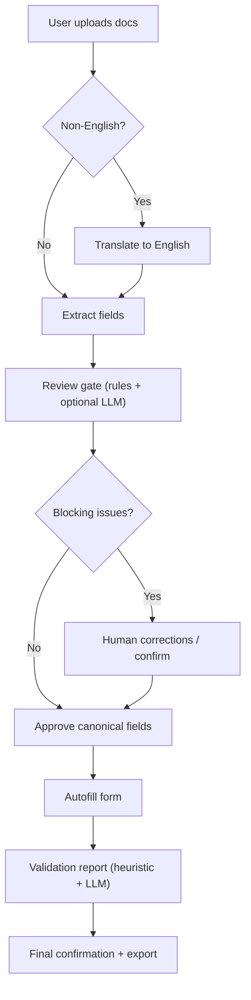

# G-28 Doc Extractor + Autofill
Upload a passport + G-28, extract structured fields with evidence, autofill the target form, and validate.

## Quickstart
Create a `.env` file in the repo root (same level as this README) and add only the settings you need.

### Prereqs
- Python 3.11 (repo venv is 3.11) + pip
- Node.js 18+ (Vite 5)
- Tesseract OCR and Poppler (required for OCR + PDF rendering)
- Playwright browsers (required for autofill)
- OpenAI API key if you enable translation/LLM validation/LLM extraction

### Environment
```bash
# .env (repo root)
OPENAI_API_KEY=your_openai_api_key
ENABLE_LLM=1
LLM_ENDPOINT=https://api.openai.com/v1/chat/completions
LLM_API_KEY=your_openai_api_key
```

Optional frontend override:
```bash
# app/frontend/.env
VITE_API_BASE=http://localhost:8000
```

### Run backend
From the repo root, start the API server:
```bash
cd app/backend
python -m venv .venv
source .venv/bin/activate
pip install -r requirements.txt
python -m playwright install
PYTHONPATH=.. uvicorn backend.main:app --reload
```

### Run frontend
In a second terminal from the repo root, start the UI:
```bash
cd app/frontend
npm install
npm run dev
```

### Open the app
Visit http://localhost:5173 (API defaults to http://localhost:8000).

## How it works (user flow)
1. Upload documents (passport + G-28 + supporting docs).
2. The app detects whether translation is needed.
3. If non-English, translate to English first.
4. Extract structured fields with evidence + confidence.
5. Run the pre-autofill review gate (rules + optional LLM checks).
6. Resolve blocking fields and approve the canonical snapshot.
7. Autofill the target form using canonical fields.
8. Validate filled values and review the status report table (heuristic + LLM).

## Pipeline diagram


## Deeper docs
- docs/README.md
- docs/architecture.md
- docs/data-models.md
- docs/extractor.md
- docs/autofill.md
- docs/validation.md
- docs/conflict-resolution.md
- docs/patterns-and-directory.md
