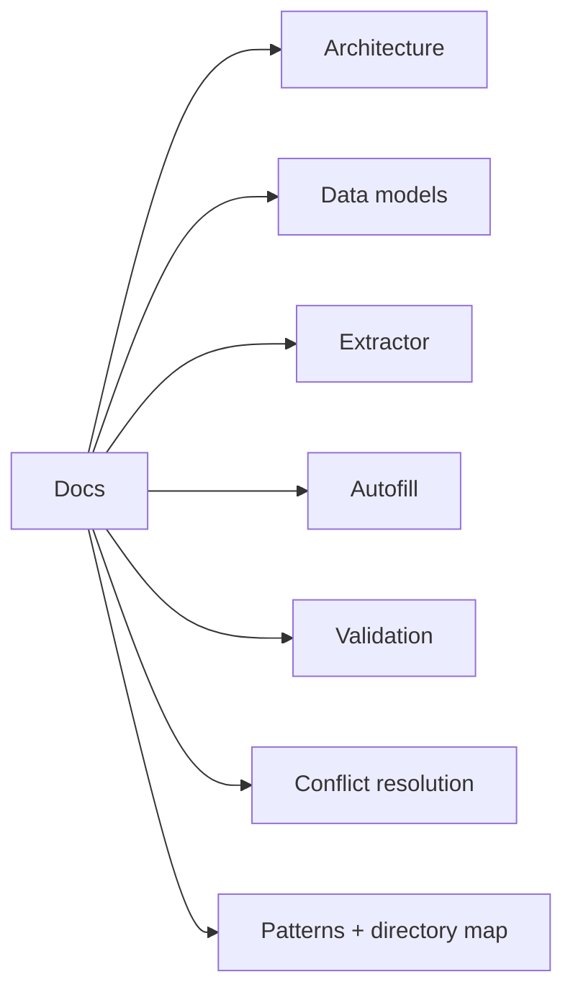

# Documentation index



## Overview
- Backend FastAPI service handles OCR, translation, extraction, validation, and autofill orchestration.
- Frontend React UI drives upload, review, and human-in-the-loop decisions.
- Artifacts are written per run under `app/backend/runs/<run_id>/` for auditability.
- Extraction produces structured fields plus evidence + confidence metadata.
- Autofill uses Playwright to map extracted fields to a target form.
- Validation combines deterministic rules with optional LLM checks.

## Docs index
| Topic | File |
| --- | --- |
| Architecture | architecture.md |
| Data models | data-models.md |
| Extractor pipeline | extractor.md |
| Autofill pipeline | autofill.md |
| Validation pipeline | validation.md |
| Conflict resolution | conflict-resolution.md |
| Patterns + directory map | patterns-and-directory.md |

## Where in code
- Backend API + pipeline orchestration: `app/backend/main.py`
- Core extraction/translation/validation modules: `app/backend/pipeline/`
- Autofill automation: `app/backend/automation/fill_form.py`
- Frontend UI: `app/frontend/src/App.jsx`

## JSON example
```json
{
  "run_id": "20260206_192156_63694350",
  "result": {
    "passport": { "given_names": "ANA", "surname": "GARCIA" },
    "g28": { "attorney": { "family_name": "LEE" } },
    "meta": {
      "sources": { "passport.surname": "MRZ" },
      "confidence": { "passport.surname": 0.95 },
      "evidence": { "passport.surname": "MRZ: GARCIA" }
    }
  }
}
```
