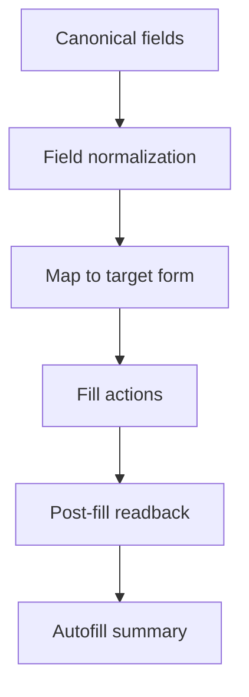

# Autofill pipeline



## How it works
- Autofill consumes the approved canonical snapshot (pre-autofill review gate).
- Field normalization: dates are normalized before fill; empty values are skipped.
- Form mapping: field paths are mapped to label hints in `field_registry`.
- Retries/partial fill: multiple candidate locators are ranked; failures are tracked per field.
- Unknown/missing values: fields without values are skipped and recorded in the summary.

## Where in code
- Field targets + labels: `app/backend/field_registry.py`
- Autofill logic (Playwright): `app/backend/automation/fill_form.py`
- API endpoint: `app/backend/main.py` (`/autofill`)

## Outputs
- `autofill_summary.json` written to `app/backend/runs/<run_id>/`
- Playwright trace at `app/backend/runs/<run_id>/trace.zip`
- Canonical snapshot at `app/backend/runs/<run_id>/canonical_fields.json`

## JSON example
```json
{
  "filled_fields": ["g28.attorney.family_name", "passport.passport_number"],
  "fill_failures": { "g28.attorney.email": "no_match" },
  "dom_readback": { "passport.passport_number": "X1234567" },
  "trace_path": "app/backend/runs/20260206_203720_ca734637/trace.zip",
  "final_url": "https://mendrika-alma.github.io/form-submission/"
}
```
