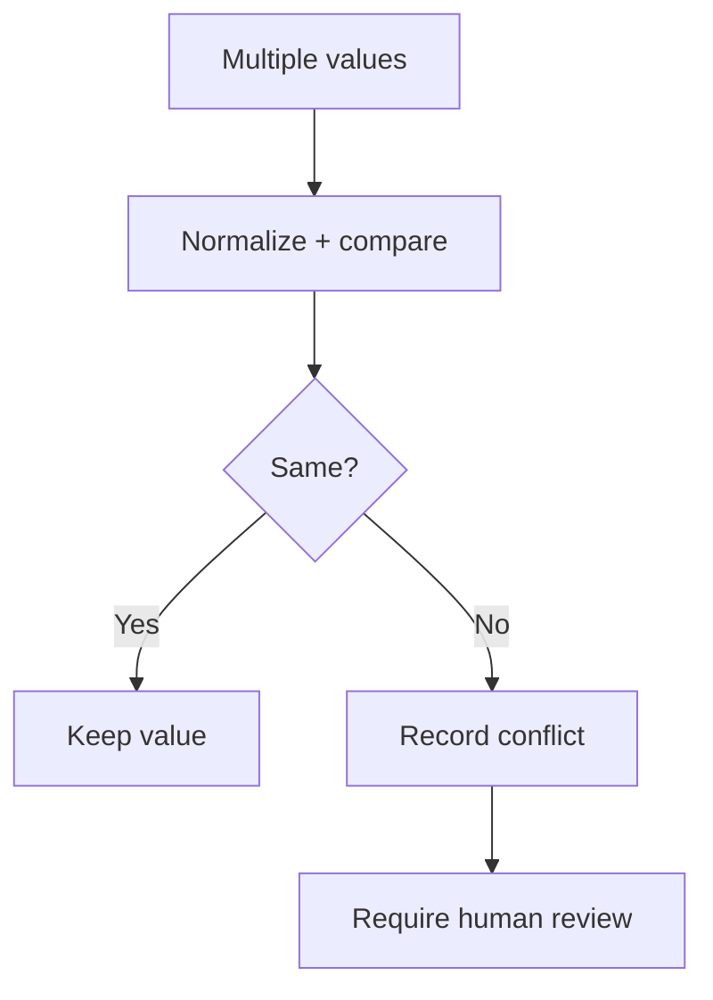

# Conflict resolution



## What a conflict means
- Passport and G-28 disagree on identity fields.
- Multiple extraction sources (MRZ vs OCR vs LLM) disagree.
- Low-confidence value conflicts with a higher-confidence one.

## Resolution strategy
- Precedence: MRZ-based passport identity is preferred when present.
- Confidence-weighted choice: higher-confidence source is selected as provisional.
- Evidence quality: clear MRZ/OCR evidence beats noisy text.
- If unresolved, mark `requires_human_input` and surface both candidates.
- Conflicts must be resolved in the pre-autofill review gate before canonical approval.

## UI behavior
- Show candidate values side-by-side with evidence snippets.
- Require user confirmation for the resolved value.

## Where in code
- Conflict detection + resolution: `app/backend/main.py`
- Conflict storage: `app/backend/schemas.py` (`meta.conflicts`)
- Review UI + edits: `app/frontend/src/App.jsx`

## JSON example
```json
{
  "meta": {
    "conflicts": {
      "g28.client.family_name": {
        "passport_value": "GARCIA",
        "g28_value": "GARCIA-LOPEZ"
      }
    }
  }
}
```
