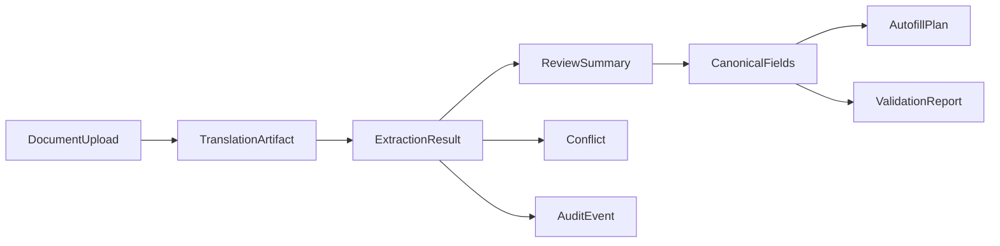

# Data models



## DocumentUpload
Purpose: describes the uploaded files for a run (stored on disk under the run directory).

Minimal schema:
```json
{
  "run_id": "20260206_192156_63694350",
  "inputs": [
    { "doc_type": "passport", "filename": "passport.pdf", "path": "app/backend/runs/20260206_192156_63694350/inputs/passport.pdf" },
    { "doc_type": "g28", "filename": "g28.pdf", "path": "app/backend/runs/20260206_192156_63694350/inputs/g28.pdf" }
  ]
}
```

Where in code:
- Upload handling + run directory layout: `app/backend/main.py`
- Ingestion + preprocessing: `app/backend/pipeline/ingest.py`

## TranslationArtifact
Purpose: stores OCR text + translation metadata per document.

Minimal schema (from `text_artifact.json`):
```json
{
  "doc_type": "passport",
  "source_file": "passport.pdf",
  "language": { "detected": "es", "confidence": 0.91 },
  "text": { "raw": "...", "translated_en": "...", "active": "translated_en" },
  "meta": { "ocr_engine": "tesseract", "translation_engine": "gpt-4o-mini", "created_at": "2026-02-06T19:21:56Z" }
}
```

Where in code:
- Artifact creation + schema: `app/backend/pipeline/text_artifact.py`
- Language detection: `app/backend/pipeline/lang_detect.py`
- Translation: `app/backend/pipeline/translate.py`

## ExtractionResult
Purpose: structured extraction output for passport + G-28 plus metadata.

Minimal schema:
```json
{
  "passport": { "given_names": "ANA", "surname": "GARCIA", "passport_number": "X1234567" },
  "g28": { "attorney": { "family_name": "LEE", "email": "lee@example.com" } },
  "meta": {
    "sources": { "passport.passport_number": "MRZ" },
    "confidence": { "passport.passport_number": 0.95 },
    "evidence": { "passport.passport_number": "MRZ: X1234567" },
    "status": { "passport.passport_number": "green" },
    "conflicts": {},
    "warnings": []
  }
}
```

Where in code:
- Schema definition: `app/backend/schemas.py`
- Extraction pipeline: `app/backend/main.py`, `app/backend/pipeline/passport.py`, `app/backend/pipeline/g28.py`

## ReviewSummary
Purpose: pre-autofill gate summary derived from rule + LLM checks.

Minimal schema:
```json
{
  "blocking": 0,
  "needs_review": 2,
  "auto_approved": 34,
  "optional_missing": 5,
  "ready_for_autofill": true
}
```

Where in code:
- Summary computation: `app/backend/pipeline/review.py`
- Review endpoint: `app/backend/main.py` (`/review`)

## CanonicalFields
Purpose: user-approved snapshot of fields used for autofill.

Minimal schema:
```json
{
  "run_id": "20260206_203720_ca734637",
  "approved_at": "2026-02-06T20:37:20Z",
  "fields": {
    "passport.passport_number": {
      "value": "X1234567",
      "status": "green",
      "source": "USER"
    }
  }
}
```

Where in code:
- Approval endpoint: `app/backend/main.py` (`/approve_canonical`)
- Stored as: `app/backend/runs/<run_id>/canonical_fields.json`

## Field
Purpose: single field with value + source + confidence + evidence. This is assembled from the `ExtractionResult` plus `meta.*` maps.

Minimal schema:
```json
{
  "path": "passport.passport_number",
  "value": "X1234567",
  "source": "MRZ",
  "confidence": 0.95,
  "evidence": "MRZ: X1234567"
}
```

Where in code:
- Confidence/evidence tracking: `app/backend/pipeline/confidence.py`
- Field registry + types: `app/backend/field_registry.py`

## Conflict
Purpose: records conflicting values between documents.

Minimal schema:
```json
{
  "field": "g28.client.family_name",
  "candidates": { "passport_value": "GARCIA", "g28_value": "GARCIA-LOPEZ" },
  "requires_review": true
}
```

Where in code:
- Conflict detection and resolution: `app/backend/main.py`
- Warnings + status: `app/backend/schemas.py`

## AutofillPlan
Purpose: mapping from extracted fields to target form labels.

Minimal schema (derived from field registry):
```json
{
  "targets": [
    { "path": "g28.attorney.family_name", "labels": ["2.a. Family Name", "Family Name"], "order": 1 },
    { "path": "passport.passport_number", "labels": ["2. Passport Number"], "order": 34 }
  ]
}
```

Where in code:
- Autofill targets + label hints: `app/backend/field_registry.py`
- Form matching + fill logic: `app/backend/automation/fill_form.py`

## ValidationReport
Purpose: output from deterministic + optional LLM validation.

Minimal schema:
```json
{
  "ok": false,
  "issues": [
    { "field": "passport.passport_number", "severity": "error", "rule": "passport_format", "message": "Invalid format" }
  ],
  "score": 0.82,
  "llm_used": false
}
```

Where in code:
- Schema definition: `app/backend/schemas.py`
- Rules + validation logic: `app/backend/pipeline/rules.py`, `app/backend/pipeline/validate.py`

## AuditEvent
Purpose: per-run audit logging for reproducibility.

Minimal schema (run log entry):
```json
{
  "ts": "2026-02-06T19:21:56Z",
  "stage": "extract",
  "message": "Extraction complete"
}
```

Where in code:
- Run logging: `app/backend/main.py`
- Autofill logging: `app/backend/automation/fill_form.py`
