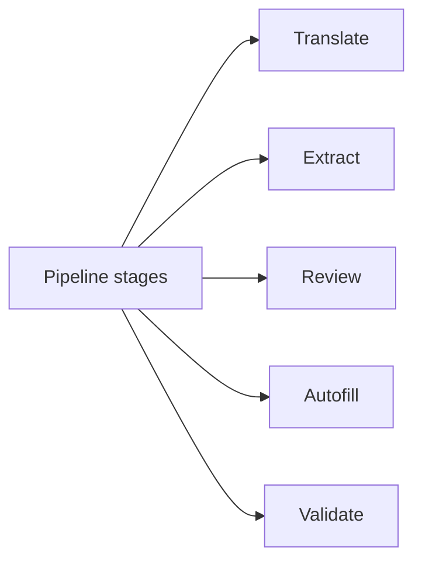

# Patterns and directory map



## Patterns
- Staged pipeline: translation -> extraction -> review -> autofill -> validation.
- Rejects and retries: label-noise filtering + fallback candidates for OCR.
- Human-in-the-loop gates: conflicts or low confidence require edits.
- Canonical snapshot: approval before autofill, stored as `canonical_fields.json`.
- LLM checks for flagged fields only (not for green fields).
- Hybrid validation: deterministic rules with optional LLM augmentation.
- Audit logging: run logs + artifact snapshots per run.

## Deterministic validation rules (regex/heuristics)
- Implemented in `app/backend/pipeline/rules.py` with shared label-noise checks in `app/backend/pipeline/label_noise.py`.
- Regex/format checks include: email, passport number, ZIP/postal, phone length, and name/address heuristics.
- Date checks enforce past/future direction (not age ranges).

## Directory map
- Backend entrypoint: `app/backend/main.py`
- API routes + orchestration: `app/backend/main.py`
- Pipeline modules: `app/backend/pipeline/`
- Prompts/templates: `app/backend/pipeline/prompts.py`
- Schemas/models: `app/backend/schemas.py`
- Field registry + mapping: `app/backend/field_registry.py`
- Autofill automation: `app/backend/automation/fill_form.py`
- Frontend UI: `app/frontend/src/App.jsx`
- Tests + fixtures: `app/backend/tests/`, `app/frontend/tests/`

## If you are reviewing the system, start here
1. Pipeline orchestrator: `app/backend/main.py`
2. Extractor core: `app/backend/pipeline/passport.py`, `app/backend/pipeline/g28.py`
3. Validation core: `app/backend/pipeline/validate.py`, `app/backend/pipeline/rules.py`
4. Autofill core: `app/backend/automation/fill_form.py`
5. UI review screen: `app/frontend/src/App.jsx`

## Where in code
- Pipeline configuration + defaults: `app/backend/config.py`
- Run artifacts and logs: `app/backend/runs/`

## JSON example
```json
{
  "run_id": "20260206_195528_4503fc69",
  "artifacts": {
    "inputs": ["inputs/passport.pdf", "inputs/g28.pdf"],
    "extracted": "extracted.json",
    "autofill": "autofill_summary.json",
    "validation": "final_snapshot.json"
  }
}
```
