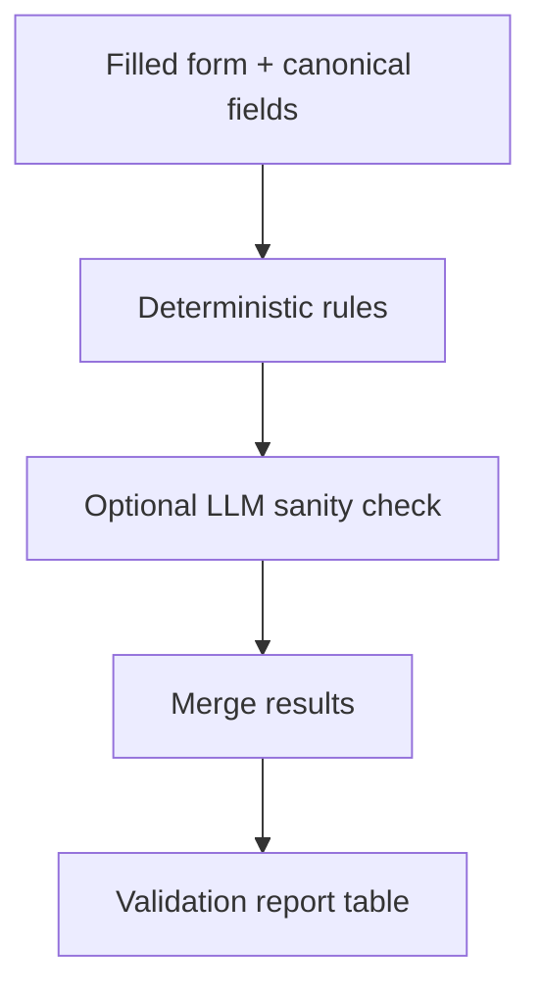

# Validation pipeline (hybrid)



## Validation types
- Deterministic rules: regex/format checks (email, passport number, ZIP, dates, names, phone, address fields).
- Cross-field consistency: MRZ check digits + required field checks.
- Source-evidence alignment: values flagged if they look like labels/headers or placeholders.
- Optional LLM validator: enabled with `ENABLE_LLM=1` and `OPENAI_API_KEY` (or `LLM_*`).

## Deterministic criteria (what is enforced today)
- Email: must match `RE_EMAIL` (requires `@` + dot + valid domain chars).
- Passport number: 7–9 alphanumeric (`RE_PASSPORT`).
- Phone: 7–15 digits after stripping non-digits.
- Name: >=2 chars, <=6 words, no digits, alpha ratio >= 0.5, reject label/header noise.
- Dates: `date_past` cannot be in the future; `date_future` cannot be in the past (normalized when possible).
- ZIP: US ZIP `#####` or `#####-####`; non‑US allows generic 3–10 alnum/hyphen.
- Address street/city/country: must include letters; reject numeric‑only or label‑like text.
- Address unit: accepts apt/ste/suite/etc. or digits; optional placeholders allowed for some fields.
- Sex: normalized to allowed values (rejects unknown).

Note: There is no explicit DOB age-range check (e.g., max age) in the current rules—only past/future validation.

## Rejects pattern
- Fail fast on clearly invalid formats (e.g., invalid passport number).
- Downgrade/flag label-like values (e.g., "Family Name").
- Request review when conflicts or missing required values are detected.

## Outputs
- Post-autofill validation returns per-field status, deterministic reasoning, and optional LLM verdicts.
- UI renders a status report table with source, issues, heuristic verdict, LLM verdict (if invoked), and a short reason.

## Where in code
- Rules and normalization: `app/backend/pipeline/rules.py`, `app/backend/pipeline/normalize.py`
- Validation orchestration: `app/backend/pipeline/validate.py`
- Post-autofill validation (table source): `app/backend/pipeline/post_autofill.py`

## JSON example
```json
{
  "ok": false,
  "issues": [
    {
      "field": "passport.passport_number",
      "severity": "error",
      "rule": "passport_format",
      "message": "Invalid format",
      "current_value": "X12"
    }
  ],
  "score": 0.74,
  "llm_used": false
}
```
